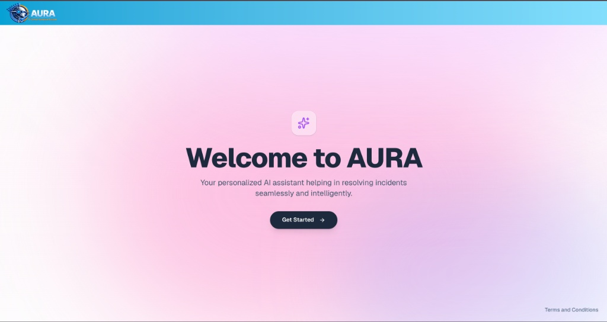

# AURA (AI Unified Resolution Assistant)

AURA is an intelligent incident resolution platform built to retrieve, summarize, and manage incident data seamlessly.

---

## 1. Welcome & Landing Page



**System Description:**  
The entry point of the platform features the AURA branding (**AI Unified Resolution Assistant**). Clicking **"Get Started"** navigates directly to the core chat interface.

**Veo Video Scene Description:**
* **Visual:** Smooth zoom-in on the clean landing page showcasing the text "Welcome to AURA". A cursor moves to click the central dark "Get Started" button.
* **AI Voiceover:** *"Welcome to AURA—the AI Unified Resolution Assistant. Designed to bring speed and intelligence to incident management, AURA helps engineering teams resolve issues seamlessly."*

---

## 2. Interactive Chat Interface & RAG Controls


**System Description:**  
The main workspace provides pre-defined quick-ask prompts (e.g., *"Database connection pool exhausted"*, *"High CPU Demand"*) along with an open custom search bar. 

A gear icon in the top right opens the retrieval settings drawer, allowing users to configure:
* **Top K:** Number of relevant context matches retrieved (e.g., `5`).
* **Threshold / Strictness:** Similarity confidence cutoff slider (e.g., `50%`).
* **Index Data Action:** Triggers vector database re-indexing on demand.

**Veo Video Scene Description:**
* **Visual:** Transition to the main dashboard. Focus on the gear icon opening the settings drawer. Adjust the "Top K" slider to 5 and "Threshold" slider to 50%. The cursor then selects a prompt or types *"Application session timeout reported by users"* into the bottom chat input bar.
* **AI Voiceover:** *"At the core of AURA is flexible context control. Fine-tune your retrieval settings by adjusting Top-K parameters and confidence thresholds, ensuring your query fetches only the most precise matches."*

---

## 3. Ranked Match Results & Score Badging


**System Description:**  
Upon query submission, AURA queries the vector index and returns ranked incident cards labeled **A**, **B**, **C**, etc., each styled with a color-coded confidence score badge:

* **Emerald Green (`bg-emerald-500`):** Score > 70%
* **Amber Yellow (`bg-amber-500`):** Score ≤ 70%

```tsx
<Badge ${ * 100 border-0 className="{`flex" gap-2 items-center opt.score px-3 py-1 shrink-0 text-[11px] text-white variant="secondary"> 70
      ? "bg-emerald-500 hover:bg-emerald-600"
      : "bg-amber-500 hover:bg-amber-600"
  }`}
>
  <span className="text-sm font-bold">{String.fromCharCode(65 + i)}</span>
  <div className="h-3.5 w-[1px] bg-white/50" />
  <span className="font-medium">
    Score: {(opt.score * 100).toFixed(1)}%
  </span>
</Badge>