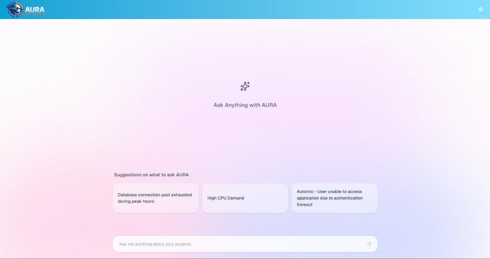
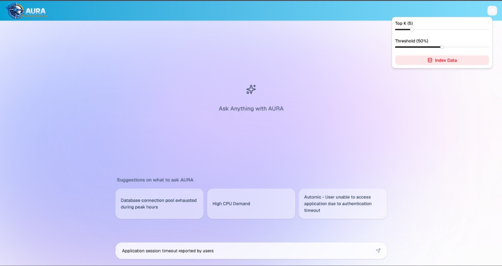
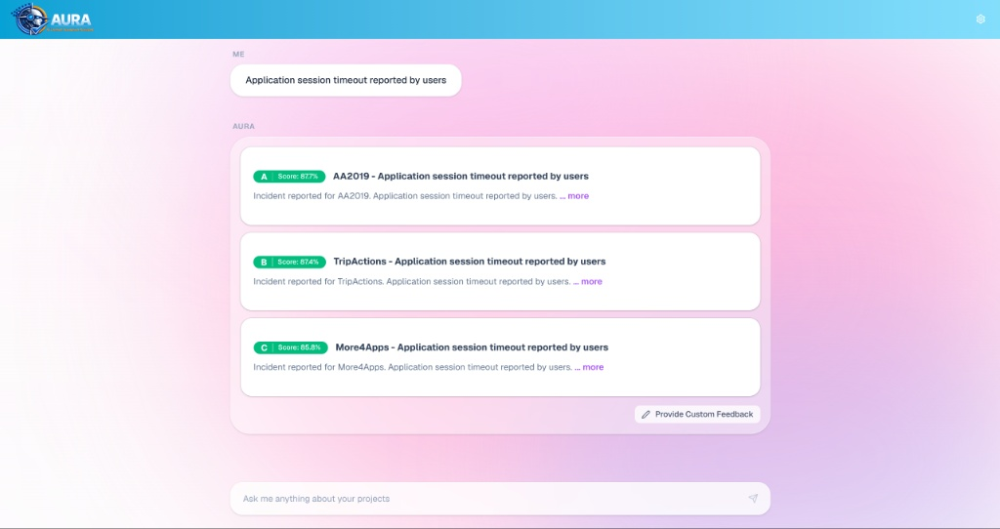
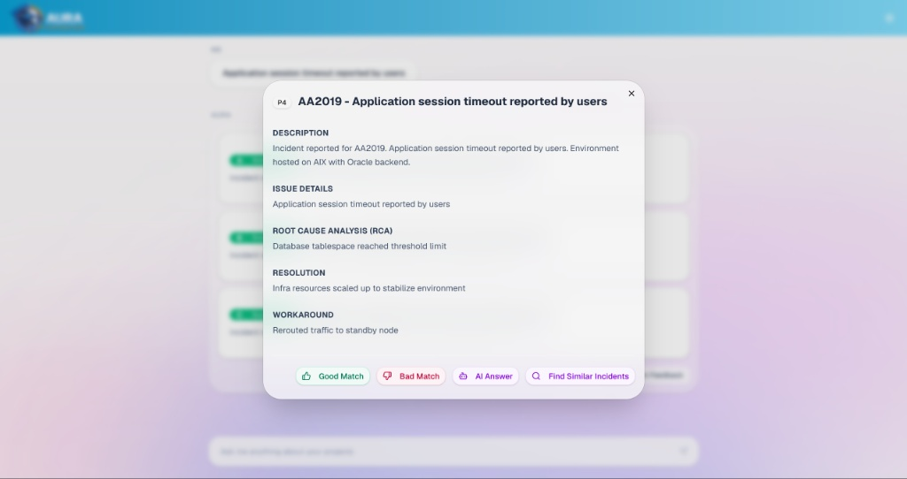
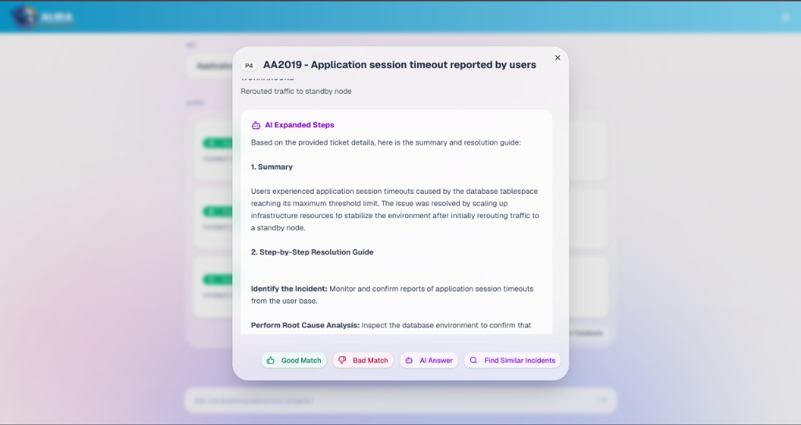
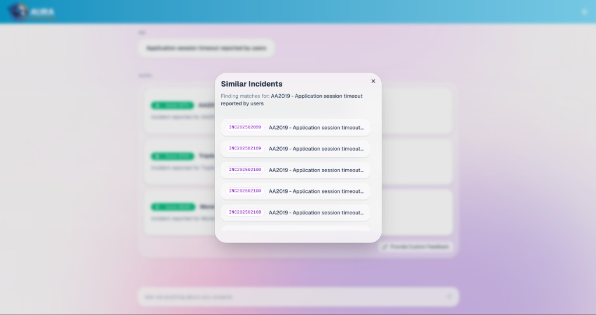
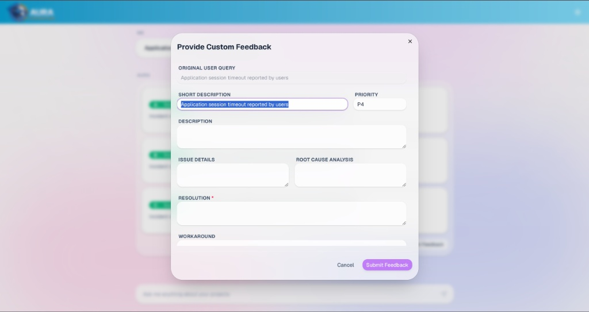

# AURA (AI Unified Resolution Assistant)

AURA is an intelligent incident resolution platform built to retrieve, summarize, and manage incident data seamlessly.

---

## 1. Welcome & Landing Page

**System Description:**  
The entry point of the platform features the AURA branding (**AI Unified Resolution Assistant**). Clicking **"Get Started"** navigates directly to the core chat interface.

**Veo Video Scene Description:**
* **Visual:** Smooth zoom-in on the clean landing page showcasing the text "Welcome to AURA". A cursor moves to click the central dark "Get Started" button.
* **AI Voiceover:** *"Welcome to AURA—the AI Unified Resolution Assistant. Designed to bring speed and intelligence to incident management, AURA helps engineering teams resolve issues seamlessly."*

---

## 2. Interactive Chat Interface & RAG Controls

**System Description:**  
The main workspace provides pre-defined quick-ask prompts (e.g., *"Database connection pool exhausted"*, *"High CPU Demand"*) along with an open custom search bar. 

A gear icon in the top right opens the retrieval settings drawer, allowing users to configure:
* **Top K:** Number of relevant context matches retrieved (e.g., 5).
* **Threshold / Strictness:** Similarity confidence cutoff slider (e.g., 50%).
* **Index Data Action:** Triggers vector database re-indexing on demand.

**Veo Video Scene Description:**
* **Visual:** Transition to the main dashboard. Focus on the gear icon opening the settings drawer. Adjust the "Top K" slider to 5 and "Threshold" slider to 50%. The cursor then selects a prompt or types *"Application session timeout reported by users"* into the bottom chat input bar.
* **AI Voiceover:** *"At the core of AURA is flexible context control. Fine-tune your retrieval settings by adjusting Top-K parameters and confidence thresholds, ensuring your query fetches only the most precise matches."*

---

## 3. Ranked Match Results & Score Badging

**System Description:**  
Upon query submission, AURA queries the vector index and returns ranked incident cards labeled **A**, **B**, **C**, etc., each styled with a color-coded confidence score badge:

* **Emerald Green (bg-emerald-500):** Score > 70%
* **Amber Yellow (bg-amber-500):** Score <= 70%

The badges dynamically display the option letter and the exact confidence score percentage to the user.

**Veo Video Scene Description:**
* **Visual:** Smooth scrolling down the conversation thread showing options A (87.7%), B (87.4%), and C (85.8%) highlighted with green confidence pills.
* **AI Voiceover:** *"AURA instantly retrieves and ranks existing incidents based on similarity scores, complete with visual indicator badges to highlight high-confidence matches."*

---

## 4. Deep-Dive Modal & AI Summary Generation

**System Description:**  
Clicking any result card opens an Incident Detail modal displaying metadata (Description, RCA, Resolution, Workaround) along with action triggers:
* **Good / Bad Match:** Quick feedback buttons.
* **AI Answer:** Dynamically synthesizes ticket data into an **AI Expanded Steps** resolution guide within the current modal.
* **Find Similar Incidents:** Triggers secondary matching logic.

**Veo Video Scene Description:**
* **Visual:** Click on option **A**. The incident details pop up. Hover over and click **"AI Answer"**. The view populates with an inline summary titled "AI Expanded Steps" detailing step-by-step resolution steps.
* **AI Voiceover:** *"Select any incident card to view comprehensive root cause analysis. Need a tailored resolution? Click 'AI Answer' to dynamically generate step-by-step action points synthesized directly from the ticket data."*

---

## 5. Duplicate & Similar Incident Discovery

**System Description:**  
Clicking **"Find Similar Incidents"** closes the active modal and opens a focused dialog listing duplicate or historically linked incident IDs (e.g., INC202502899, INC202502169).

**Veo Video Scene Description:**
* **Visual:** Click the **"Find Similar Incidents"** button inside the modal. The window transitions smoothly into a "Similar Incidents" list showing matching incident tracking IDs.
* **AI Voiceover:** *"Easily track pattern trends. With one click, discover identical or duplicate historical incidents across your system."*

---

## 6. Feedback Loop & Knowledge Base Expansion

**System Description:**  
From the chat view, users can click **"Provide Custom Feedback"** to submit custom resolution paths. Once approved, these custom solutions are embedded into the vector database, enabling immediate search visibility for all users.

**Veo Video Scene Description:**
* **Visual:** Return to the chat window and click the **"Provide Custom Feedback"** button below the answers. A modal form appears with fields for *Description*, *Root Cause Analysis*, *Resolution*, and *Workaround*. The user fills in custom feedback and clicks **"Submit Feedback"**.
* **AI Voiceover:** *"Continuous learning made simple. If the existing data doesn't fully answer your query, submit custom feedback directly. Once approved, it is indexed back into the vector database—making your system smarter for everyone."*